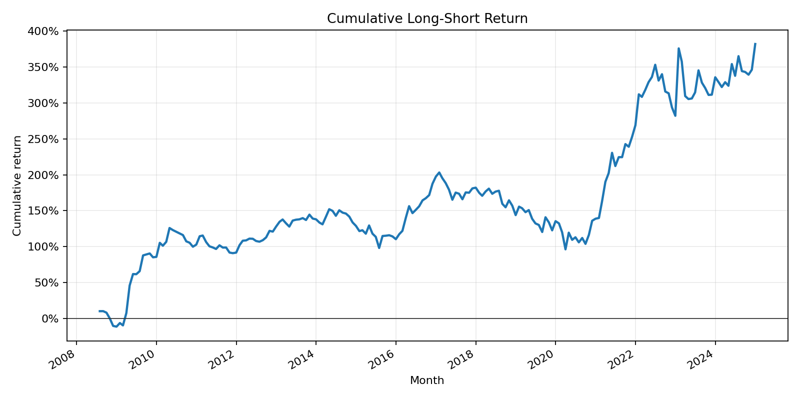
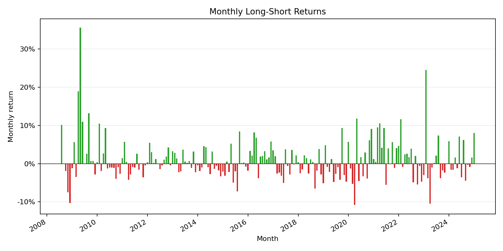
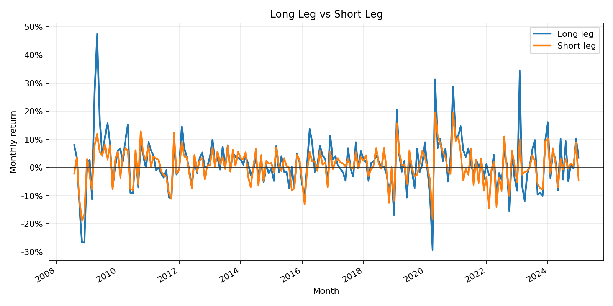
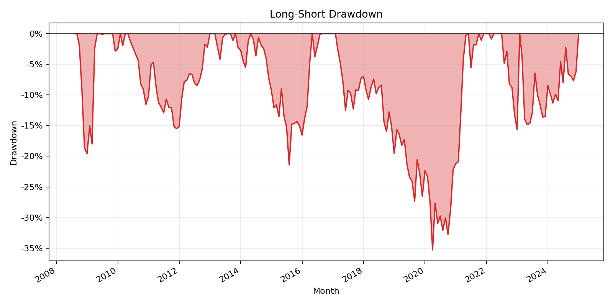

# WRDS Factor Zoo Replication

A quantitative research project that replicates classic equity factor strategies using WRDS data. The pipeline pulls CRSP and Compustat data, links firms through CCM, builds factor signals, backtests long-short portfolios, and produces performance metrics and charts.

## Tech Stack

Python, WRDS, pandas, NumPy, Matplotlib, unittest

## Factors

- Value: book-to-market
- Size: lagged market equity
- Profitability: operating profitability
- Investment: negative asset growth
- Momentum: 12-2 month prior return

## Project Structure

```text
.
├── data/              # Local WRDS extracts and generated datasets; do not commit
├── reports/           # Metrics and chart outputs for GitHub/README display
├── src/               # Pipeline source files
├── tests/             # Unit tests
└── README.md
```

## Pipeline

```bash
python3 src/wrds_access_check.py
python3 src/wrds_pull.py --start-date 2008-01-01 --end-date 2024-12-31 --file-format csv
python3 src/clean_crsp.py --input data/crsp_monthly.csv --output data/crsp_monthly_clean.csv
python3 src/clean_compustat.py --input data/compustat_annual.csv --output data/compustat_annual_clean.csv
python3 src/factors.py --crsp data/crsp_monthly_clean.csv --compustat data/compustat_annual_clean.csv --ccm data/ccm_links.csv --output data/factor_panel.csv
python3 src/backtest.py --input data/factor_panel.csv --signal value --output data/value_backtest.csv
python3 src/analytics.py --input data/value_backtest.csv --output reports/value_metrics.csv
python3 src/visualize.py --input data/value_backtest.csv --output-dir reports --prefix value
```

For other factors, replace `value` with `profitability`, `investment`, `momentum_12_2`, or `size`.

## Results

Place generated PNGs in `reports/`. GitHub will render them from these relative paths:









Key outputs:

- `reports/value_metrics.csv`: summary statistics
- `reports/value_cumulative_return.png`: compounded long-short performance
- `reports/value_monthly_returns.png`: monthly factor return distribution
- `reports/value_long_vs_short.png`: long and short leg comparison
- `reports/value_drawdown.png`: peak-to-trough drawdowns

## Interpretation

The main result is the long-short factor return: the high-signal portfolio minus the low-signal portfolio. Stronger evidence comes from a positive CAGR, reasonable Sharpe ratio, controlled drawdowns, and consistency over many years rather than a few strong months.

The current implementation is a clean factor-style replication framework, not an exact recreation of the official Fama-French library portfolios.

## Tests

```bash
python3 -m unittest discover tests
```

## Data Note

WRDS data is licensed and should not be committed. Keep `data/` ignored in Git and commit only source code, tests, documentation, and selected report images.